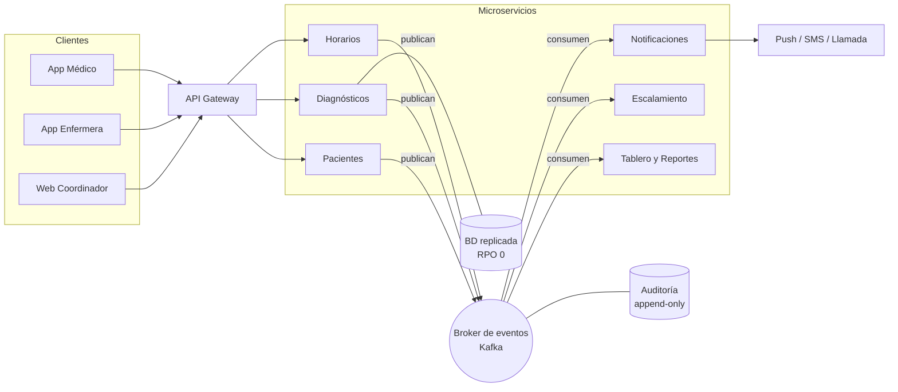

# Selección de Arquitectura — Caso Essalud UCI

## Arquitectura elegida: **Event-Driven Architecture (EDA)**

Eventos como columna vertebral de la comunicación (publish/subscribe a través de un broker), con el sistema descompuesto en servicios independientes que producen y consumen esos eventos (microservicios como unidad de despliegue, hexagonal como organización interna de cada servicio — complementos, no la elección).

**¿Por qué EDA y no otra, si solo se puede elegir una?** Porque el problema dominante del caso no es cómo organizar el código (hexagonal) ni cómo particionar el sistema (microservicios): es que **eventos críticos ocurren en un lugar y varios interesados deben reaccionar de inmediato** — un paciente se agrava a las 3 a.m., un turno se cierra, una indicación cambia. Las tres problemáticas críticas del enunciado son reacciones a eventos, y el broker aporta además la resiliencia (las alertas persisten aunque un consumidor esté caído) y la escala horizontal que exigen los requerimientos no funcionales.

---

## 1. Drivers arquitectónicos (qué exige el problema)

Del caso de estudio y de nuestros requerimientos ([ReqFunc](Requirements/ReqFunc.md), [ReqNoFunc](Requirements/ReqNoFunc.md)):

| Driver | Fuente |
|---|---|
| Escalar de 1K → 100K → 10M hospitales sin rediseño | RNF01, RNF02 |
| Notificaciones push en tiempo real a múltiples médicos/enfermeras | RF12, RF14, RNF05 (<5s) |
| Problema de medianoche: contactar al médico y **escalar** si no responde en 3 min | RF11, RF13 |
| Rotación de doctores: diagnóstico siempre disponible para el turno entrante | RF06–RF08 |
| Disponibilidad 99.9%, recuperación <5 min, sin pérdida de diagnósticos (RPO 0) | RNF07–RNF10 |
| Criticidad desigual: alertas de paciente grave ≠ reportes administrativos | RF12 vs RF16 |

## 2. Evaluación de las alternativas vistas en clase

| Criterio | 3-Tier | Hexagonal | Microservicios | **Event-Driven** |
|---|---|---|---|---|
| Escala a 10M hospitales | ✗ escala el monolito completo | ✗ es un patrón de organización interna, no de escala | ✓ escala por servicio | ✓ el broker absorbe picos, consumidores escalan horizontal |
| Notificaciones en tiempo real 1→N | ✗ requiere polling o acoplar módulos | ✗ no lo aborda | ~ posible con llamadas directas (acoplamiento) | ✓ publish/subscribe es exactamente esto |
| Escalamiento de alertas (medianoche) | ✗ lógica ad-hoc | ✗ no lo aborda | ~ | ✓ evento no confirmado → timer → evento de escalación |
| Aislamiento de fallas (alertas viven aunque caigan reportes) | ✗ un bug tumba todo | ✗ | ✓ | ✓ consumidores independientes + cola como buffer |
| Resiliencia ante caídas (RTO <5min, RPO 0) | ~ | ~ | ~ | ✓ los eventos persisten en el broker y se procesan al recuperarse |
| Simplicidad operativa | ✓ la más simple | ✓ | ✗ alta complejidad | ✗ alta complejidad |

**Por qué no 3-Tier:** suficiente para una app departamental (como el caso LATAM de clase), pero aquí un solo despliegue no puede escalar a 10M hospitales, y el acoplamiento hace que un fallo en reportes comprometa las alertas de pacientes graves — inaceptable en UCI.

**Por qué no Hexagonal (sola):** hexagonal resuelve *cómo organizar el interior de un servicio* (aislar el dominio de sus adaptadores), no cómo escalar ni comunicar un sistema distribuido. No es alternativa a EDA — es complementaria: **la usamos dentro de cada microservicio** (el dominio clínico aislado de FCM/SMS/BD mediante puertos y adaptadores).

**Por qué no microservicios "a secas" (con llamadas síncronas):** si el servicio de diagnósticos llama por REST al de notificaciones y este está caído, la alerta se pierde o el médico se queda esperando. Con eventos, la alerta queda persistida en el broker y se entrega apenas el consumidor se recupera — crítico para el problema de medianoche.

## 3. Cómo la arquitectura resuelve las 3 problemáticas críticas

Los eventos del dominio:

| Evento | Productor | Consumidores | Problemática que resuelve |
|---|---|---|---|
| `paciente_agravado` | Servicio Pacientes (enfermera lo marca) | Notificaciones (push+SMS+llamada), Escalamiento, Auditoría | **Medianoche** (RF12) |
| `alerta_no_confirmada` (timer 3 min) | Servicio Escalamiento | Notificaciones (→ suplente → jefe UCI), Auditoría | **Medianoche** (RF13) |
| `turno_cerrado` | Servicio Diagnósticos | Generador de resumen de traspaso, Auditoría | **Rotación de doctores** (RF07) |
| `diagnostico_registrado` / `indicacion_actualizada` | Servicio Diagnósticos | Notificaciones (médicos/enfermeras del paciente), Caché offline, Auditoría | **Tiempo real** (RF09, RF14) |
| `turno_publicado` / `ausencia_registrada` | Servicio Horarios | Notificaciones, Tablero regional, Sugeridor de suplentes | Horarios sin cruces (RF02–RF05) |

## 4. Vista general

- **Diagnósticos** replica síncronamente en 2 zonas (RNF10) y alimenta la caché offline de las apps (RF08/RNF09).
- **Notificaciones** y **Escalamiento** escalan de forma independiente — son la ruta crítica de <5s (RNF05).
- El **despliegue es multi-región** (Lima primero, luego el resto del país) agregando particiones/clusters por región (RNF02).

## 5. Trade-offs asumidos y mitigaciones

| Costo de EDA | Mitigación |
|---|---|
| Consistencia eventual entre servicios | El dato clínico crítico (diagnóstico) se lee siempre de su servicio dueño; los eventos solo propagan notificaciones y vistas |
| Entrega "al menos una vez" → duplicados | Consumidores idempotentes (ID de evento único, deduplicación) |
| Difícil de trazar extremo a extremo | Correlation IDs en cada evento + trazas distribuidas + la bitácora de auditoría (RF17) |
| Complejidad operativa (broker, orquestación) | Broker gestionado en la nube; se justifica porque la escala (10M hospitales) y la criticidad UCI lo exigen |

## 6. Conclusión

Elegimos **Event-Driven Architecture sobre microservicios, con hexagonal al interior de cada servicio**, porque las tres problemáticas críticas del caso (rotación de turno, medianoche, tiempo real) son por naturaleza *reacciones a eventos*, y los requerimientos de escala (10M hospitales) y disponibilidad (99.9%, RPO 0 en diagnósticos) descartan cualquier despliegue monolítico. Un 3-Tier sería más simple, pero la simplicidad no es el driver dominante de este problema — la vida del paciente en el cambio de turno y a las 3 a.m. sí lo es.
